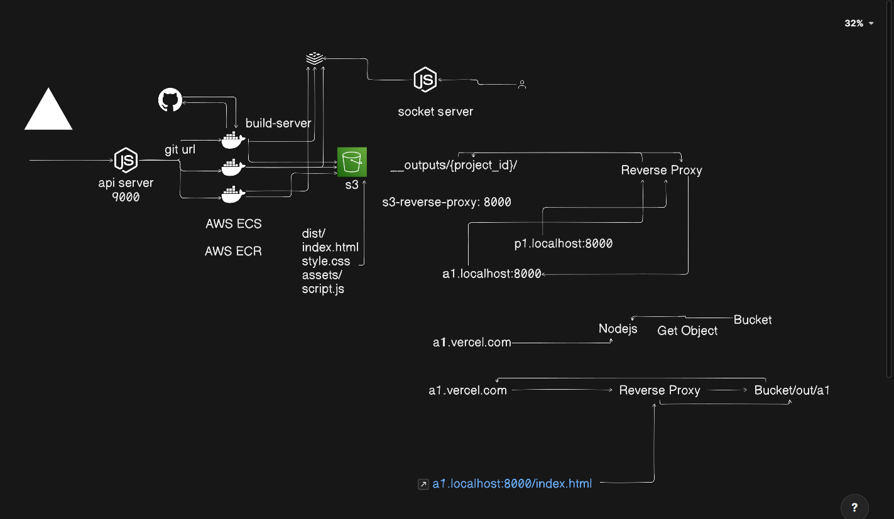

# Vercel Clone - Serverless Deployment Platform

A simplified clone of Vercel's deployment platform that automatically builds and deploys React/Vite applications to AWS S3 with custom subdomain routing.

![System Design" Diagram]

## 🏗️ Architecture Overview

This project consists of two main components that work together to provide a complete deployment solution:

### 1. Build Server (`build-server/`)
- **Purpose**: Containerized build service that clones, builds, and deploys React/Vite applications
- **Technology**: Node.js, Docker, AWS SDK
- **Infrastructure**: AWS ECS + AWS ECR
- **Storage**: AWS S3

### 2. S3 Reverse Proxy (`s3-reverse-proxy/`)
- **Purpose**: Routes subdomain requests to corresponding S3-hosted projects
- **Technology**: Express.js, HTTP Proxy
- **Port**: 8000
- **Function**: Serves static files from S3 buckets via custom subdomains

## 🔄 How It Works

1. **Code Repository**: Developer pushes code to GitHub
2. **Build Trigger**: Build server receives the repository URL
3. **Containerized Build**: 
   - Docker container clones the repository
   - Installs dependencies (`npm install`)
   - Builds the project (`npm run build`)
   - Configures Vite with S3 base URL
4. **AWS Deployment**:
   - Built files are uploaded to S3 bucket
   - Files are stored under `__outputs/{PROJECT_ID}/`
   - Public read access is configured
5. **Reverse Proxy Routing**:
   - S3 Reverse Proxy routes `{subdomain}.localhost:8000` to corresponding S3 folder
   - Serves `index.html` for root requests
   - Proxies all static assets (CSS, JS, images)

## 📁 Project Structure

```
vercel-clone/
├── build-server/
│   ├── Dockerfile              # Container configuration
│   ├── main.sh                # Entry point script
│   ├── script.js              # Build and upload logic
│   └── package.json           # Dependencies (AWS SDK, Redis)
├── s3-reverse-proxy/
│   ├── index.js               # Reverse proxy server
│   └── package.json           # Dependencies (Express, HTTP Proxy)
└── README.md
```

## 🚀 Getting Started

### Prerequisites

- Node.js (v20 or higher)
- Docker (for build server)
- AWS Account with S3 access
- AWS CLI configured

### Environment Variables

Create `.env` files in respective directories:

#### Build Server Environment (`.env`)
```bash
AWS_REGION=ap-south-2
AWS_ACCESS_KEY_ID=your_access_key
AWS_SECRET_ACCESS_KEY=your_secret_key
AWS_S3_BUCKET_NAME=stacklift-vercel-clone
PROJECT_ID=unique_project_identifier
GIT_REPO_URL=https://github.com/username/repo.git
```

#### S3 Reverse Proxy Environment
```bash
# No additional environment variables required
# S3 base path is configured in index.js
```

### Installation & Setup

#### 1. Clone the Repository
```bash
git clone <your-repo-url>
cd vercel-clone
```

#### 2. Set Up S3 Reverse Proxy
```bash
cd s3-reverse-proxy
npm install
npm run dev
```

#### 3. Configure Build Server
```bash
cd ../build-server
npm install
```

#### 4. Build Docker Image
```bash
docker build -t vercel-build-server .
```

#### 5. Configure Local DNS (for testing)
Add to your system's hosts file:
- **Windows**: `C:\Windows\System32\drivers\etc\hosts`
- **macOS/Linux**: `/etc/hosts`

```
127.0.0.1 p1.localhost
127.0.0.1 p2.localhost
127.0.0.1 a1.localhost
127.0.0.1 your-project-id.localhost
```

## 🎯 Usage

### Deploying a Project

1. **Prepare your React/Vite project** on GitHub
2. **Run the build server** with your project:
```bash
docker run -e PROJECT_ID=your-unique-id \
           -e GIT_REPO_URL=https://github.com/user/repo.git \
           -e AWS_ACCESS_KEY_ID=your_key \
           -e AWS_SECRET_ACCESS_KEY=your_secret \
           -e AWS_S3_BUCKET_NAME=your-bucket \
           vercel-build-server
```

3. **Access your deployed app**:
```bash
http://your-unique-id.localhost:8000
```

### Testing the Deployment

1. Start the reverse proxy:
```bash
cd s3-reverse-proxy
npm run dev
```

2. Open your browser and navigate to:
```
http://p1.localhost:8000
# or any subdomain you've configured
```

## 🔧 Configuration

### S3 Bucket Setup
1. Create S3 bucket in AWS Console
2. Configure public read access
3. Enable static website hosting
4. Update bucket name in environment variables

### Subdomain Routing
The reverse proxy automatically routes subdomains to S3 folders:
- `p1.localhost:8000` → `s3://bucket/__outputs/p1/`
- `a1.localhost:8000` → `s3://bucket/__outputs/a1/`

### Vite Configuration
The build server automatically generates `vite.config.js` with the correct S3 base path:
```javascript
export default defineConfig({
  plugins: [react()],
  base: 'https://your-bucket.s3.region.amazonaws.com/__outputs/project-id/'
})
```

## 📊 Monitoring & Logs

### Build Server Logs
- Container logs show build progress
- Upload status for each file
- Error messages for failed builds

### Reverse Proxy Logs
- Request routing information
- Subdomain resolution
- Proxy errors and status

Example log output:
```
🔗 Hostname: p1.localhost, Subdomain: p1
📂 Request URL: /assets/index.css
🎯 Proxying to: https://bucket.s3.region.amazonaws.com/__outputs/p1/assets/index.css
```

## 🛠️ Development

### Adding New Features
1. **Build Server**: Modify [script.js](build-server/script.js) for build logic
2. **Reverse Proxy**: Update [index.js](s3-reverse-proxy/index.js) for routing rules

### Local Development
```bash
# Terminal 1: Start reverse proxy
cd s3-reverse-proxy && npm run dev

# Terminal 2: Build and test projects
cd build-server && node script.js
```

## 🚨 Troubleshooting

### Common Issues

1. **Build Fails**:
   - Check AWS credentials
   - Verify repository accessibility
   - Ensure package.json has build script

2. **Subdomain Not Working**:
   - Check hosts file configuration
   - Verify S3 bucket permissions
   - Confirm PROJECT_ID matches subdomain

3. **Assets Not Loading**:
   - Check Vite base path configuration
   - Verify S3 bucket CORS settings
   - Ensure public read access on bucket

### Error Codes
- `502 Proxy Error`: S3 bucket/file not found
- `Build Failed`: Check build server logs
- `DNS Resolution`: Update hosts file

## 📝 License

This project is licensed under the ISC License.

## 🤝 Contributing

1. Fork the repository
2. Create a feature branch
3. Make your changes
4. Submit a pull request

## 📞 Support

For issues and questions:
- Create an issue in the repository
- Check troubleshooting section above
- Review AWS S3 and ECS documentation

---

*Built with ❤️ as a learning project to understand serverless deployment platforms*