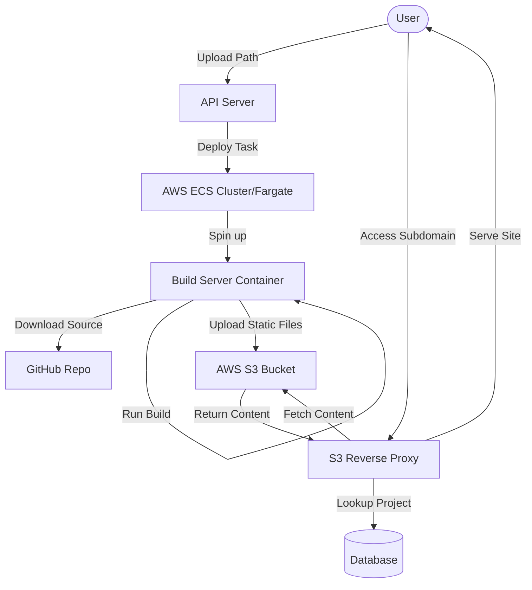

# Vercel Clone Architecture & AWS Workflow

This document explains how the project components interact and how AWS services are utilized.

## 1. System Architecture Overview

The project is a simplified Vercel clone designed to build and deploy web applications (primarily React/Next.js) using AWS infrastructure.

---

## 2. Component Breakdown

### A. API Server (`/api-server`)
- **Role:** Orchestrator and entry point.
- **Workflow:**
    1. Receives deployment requests with a GitHub URL.
    2. Uses the **AWS SDK (ECS Client)** to trigger a new task in your ECS Cluster.
    3. It passes environment variables (like the GitHub URL and `PROJECT_ID`) to the container.
- **AWS Usage:** Interacts with **Amazon ECS** to run Fargate tasks.

### B. Build Server (`/build-server`)
- **Role:** The execution environment for builds.
- **Workflow:**
    1. Clones the user's GitHub repository.
    2. Runs `npm install` and `npm run build`.
    3. Uses the **AWS SDK (S3 Client)** to upload the resulting `dist` or `build` folder to an S3 bucket.
    4. Files are stored under a specific prefix: `__outputs/<PROJECT_ID>/`.
- **AWS Usage:** Interacts with **Amazon S3** for storage.

### C. S3 Reverse Proxy (`/s3-reverse-proxy`)
- **Role:** The gateway that serves the hosted sites.
- **Workflow:**
    1. Listens for requests on subdomains (e.g., `project1.localhost` or `project1.yourdomain.com`).
    2. Extracts the subdomain and looks up the project in the database.
    3. Proxies the request to the **S3 Bucket** URL for that specific project.
    4. **Hardcoded Logic:** It maps requests to `https://<bucket>.s3.<region>.amazonaws.com/__outputs/<project_id>/index.html`.
- **AWS Usage:** Serves content directly from **Amazon S3**.

---

## 3. AWS Services Deep Dive

### Amazon S3 (Simple Storage Service)
- **Purpose:** Reliable storage for the built static files.
- **Config:** A bucket is needed with public access or appropriate bucket policies to allow the Proxy to fetch files.

### Amazon ECS (Elastic Container Service)
- **Purpose:** Runs the Build Server as a "serverless" container (Fargate).
- **Benefit:** You only pay for the compute while a build is actually running.
- **Task Definition:** Defines the Docker image (from ECR) and resource limits (CPU/Memory).

### Amazon ECR (Elastic Container Registry)
- **Purpose:** Stores your Docker images for the `api-server` and `build-server`.
- **Deployment:** The `deploy-ecs.sh/ps1` scripts push your local code changes to ECR.

---

## 4. How the "Vercel Magic" Works (The Subdomain)

1. When you deploy, you get a unique `PROJECT_ID` or `subdomain`.
2. The **S3 Reverse Proxy** is the "Brain" for routing.
3. Instead of the user accessing a messy S3 URL, they access `my-app.com`.
4. The Proxy sees `my-app`, checks the DB, finds the ID, and silently grabs the files from S3.

---

## 5. Deployment Workflow (Using the scripts)

1. **Build Docker Images:** Locally build the containers.
2. **Push to ECR:** Authenticate with AWS and push images.
3. **Update ECS:** Update the Task Definition so AWS uses the latest version of your code.
4. **Environment Variables:** All components rely on `.env` files for AWS Access Keys, Secret Keys, and Region settings.
---

## 6. Phase-by-Phase Example (Dry Run)

Let's follow a deployment of: `https://github.com/piyushgarg-dev/react-app-test`

### Phase 1: The Trigger (Frontend & API)
1. **User Action:** You open the **Frontend (Next.js)** and paste the GitHub URL.
2. **API Call:** The Frontend calls `POST /project` on the **API Server**.
3. **Registration:** The API Server creates a `Project` in the Database with a unique ID (e.g., `proj-apple-123`).

### Phase 2: Orchestration (AWS ECS & ECR)
1. **The Request:** The API Server calls the AWS ECS `RunTask` API.
2. **Container Retrieval:** AWS ECS looks at your **Task Definition**. It sees it needs the `build-server` image.
3. **ECR Pull:** ECS pulls the Docker image from your **Amazon ECR** repository (`<account-id>.dkr.ecr.<region>.amazonaws.com/build-server`).
4. **Provisioning:** AWS spins up a **Fargate** instance (serverless compute). It injects environment variables like `GIT_REPOSITORY_URL=https://github.com/...` and `PROJECT_ID=proj-apple-123`.

### Phase 3: The Build (Inside the Container)
1. **Clone:** The `build-server` container starts and immediately clones the code.
2. **Execute:** It runs `npm install` followed by `npm run build`.
3. **Storage Mapping:** Once finished, it scans the `dist` folder.
4. **S3 Upload:** Every file is uploaded to **Amazon S3** using the path:  
   `s3://your-bucket-name/__outputs/proj-apple-123/index.html`

### Phase 4: Serving the Site (Reverse Proxy)
1. **User Access:** The user visits `http://proj-apple-123.localhost:8000`.
2. **Interception:** The **S3 Reverse Proxy** receives the request.
3. **DB Lookup:** It sees `proj-apple-123`, looks it up in the DB, and confirms it exists.
4. **Transparent Proxy:** The Proxy secretly fetches the file from:  
   `https://your-bucket-name.s3.amazonaws.com/__outputs/proj-apple-123/index.html`
5. **Delivery:** The user sees their React app instantly, but the URL remains `proj-apple-123.localhost`.
